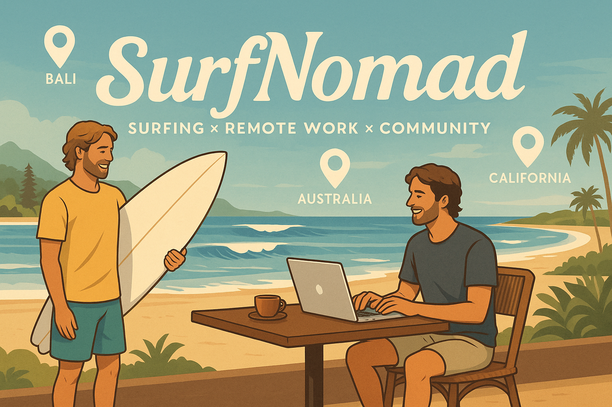

<p align="center">
  <a href="https://github.com/kai-kondo">
    
  </a>
  <a href="https://x.com/KSurfnomad">
    
  </a>
  <a href="https://www.instagram.com/kai_surfnomad">
    
  </a>
</p>

# 🌊 Nomad Surf

**Nomad Surf** is a mobile-first web application that helps surfers and remote workers discover surf-friendly destinations around the world. With a focus on community, events, and local work-friendly spots, Nomad Surf bridges the gap between waves and work.

---

## 🚀 Features

- 🗺️ **Surf Spot Explorer**
    
    Discover surf spots along with nearby coworking spaces, cafes, hostels, and surf shops.
    
- 🧘 **Event Listings**
    
    Stay up-to-date with local events such as beach cleanups, surf meetups, yoga sessions, and more.
    
- 🔍 **Filter by Tags & Date**
    
    Easily browse events by category (Surf, Wellness, Music, etc.) and date (Today, This Week, etc.).
    
- 👥 **Community Profiles** *(coming soon)*
    
    Connect with fellow surf nomads, follow their journeys, and collaborate on side projects.
    
- 📍 **Map Integration**
    
    See everything visually on an interactive map—spots, events, and local amenities.
    

---

## 📱 Tech Stack

- **Frontend**: [Next.js](https://nextjs.org/) (App Router), [Tailwind CSS](https://tailwindcss.com/)
- **Backend/DB**: [Supabase](https://supabase.com/)
- **Design**: Mobile-first, minimal, ocean-inspired

---

## 📦 Setup

1. **Clone this repository**
    
    ```
    git clone https://github.com/your-username/nomad-surf.git
    cd nomad-surf
    ```
    
2. **Install dependencies**
    
    ```
    npm install
    ```
    
3. **Create a `.env.local` file**
    
    ```
    NEXT_PUBLIC_SUPABASE_URL=your-supabase-url
    NEXT_PUBLIC_SUPABASE_ANON_KEY=your-supabase-anon-key
    ```
    
4. **Start the development server**
    
    ```
    npm run dev
    ```
    

---

## 📁 Project Structure

```
src/
  app/
    events/        # Event listing page
    components/    # UI components (Hero, Footer, Header, etc.)
    lib/           # Supabase client setup
  public/          # Images and static assets
```

---

## 🌍 Vision

We're building **Nomad Surf** to empower a global community of surf-loving remote workers. Whether you're chasing waves in Bali or coding from a coastal café in Portugal, this app helps you find your tribe.

---

## 🤝 Contributing

Coming soon! Contributions will be welcomed once we define contribution guidelines.

---

## 📧 Contact

Feel free to reach out via [X/Twitter](https://twitter.com/) – DM: `@Kai`

Or follow updates on Instagram: `@nomadsurf.app`

---

## 🏄‍♂️ Surf. Build. Repeat.
